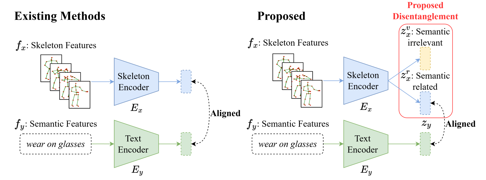
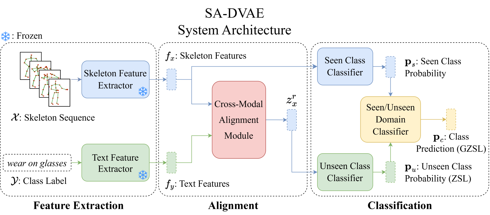

# SA-DVAE: Improving Zero-Shot Skeleton-Based Action Recognition by Disentangled Variational Autoencoders (ECCV 2024)



[Sheng-Wei Li](https://www.csie.ntu.edu.tw/~r11944004/), Zi-Xiang Wei, [Wei-Jie Chen](https://jackchen890311.github.io/), Yi-Hsin Yu, [Chih-Yuan Yang](https://yangchihyuan.github.io/people/Chih-Yuan_Yang)&#8224;, [Jane Yung-jen Hsu](https://iagentntu.github.io/professor/Jane)&#8224; (&#8224;corresponding authors)

[](https://arxiv.org/abs/2407.13460)

### What does "SA-DVAE" stand for?

SA-DVAE stands for **S**emantic **A**lignment via **D**isentangled **V**ariational **A**uto**e**ncoders.

## TL;DR
SA-DVAE improves zero-shot skeleton-based action recognition by aligning modality-specific VAEs and disentangling skeleton features into semantic and non-semantic parts, achieving better performance on NTU RGB+D, NTU RGB+D 120, and PKU-MMD datasets.



## Setting Up the Environment

The codebase has been tested with the following setup:
- Operating System: Ubuntu 22.04
- Python Version: 3.10
- GPU: 1x NVIDIA RTX 3090 with CUDA version 12.7

1. **Clone the Repository**
   ```bash
   git clone https://github.com/pha123661/SA-DVAE.git
   cd SA-DVAE
   ```

2. **Install Dependencies**
   ```bash
   pip install -r requirements.txt
   ```

3. **Download Pre-extracted Features**
   - Download the pre-extracted features for the NTU-60, NTU-120, and PKU-MMD datasets [here](https://drive.google.com/file/d/1XWLXjI3o6J1WDAN3rTGUIhbbMsIT0zWz/view?usp=drive_link).
   - Extract the `resources.zip` file.
   - Place all subdirectories under `./resources`.

   **Optional: Generate Features Yourself**
   - Download the class descriptions at [`./class_lists`](./class_lists) and skeleton features at [NTU RGB+D](https://github.com/shahroudy/NTURGB-D) and [PKUMMD](https://www.icst.pku.edu.cn/struct/Projects/PKUMMD.html).
   - Use [sentence_transformers](https://sbert.net/) or [transformers](https://huggingface.co/docs/transformers/index) packages to extract semantic features.
   - Use [mmaction2](https://github.com/open-mmlab/mmaction2) to train and extract skeleton features.

5. Ensure that the directory structure is as follows:
   ```
   SA-DVAE
   ├── resources
   │   ├── label_splits
   │   ├── sk_feats
   │   └── text_feats
   ...
   ```

## Training

We provide three training scripts in `./scripts`, each corresponding to the three main experiments in our paper:

1. **Comparison with SOTA Methods**
   ```bash
   ./scripts/train_eval_synse_split.sh {dataset}
   ```

2. **Random Class Splits**
   ```bash
   ./scripts/train_eval_average_random_split.sh {dataset}
   ```

   * This script runs experiments on three different seen/unseen class splits.

3. **Enhanced Class Descriptions by a Large Language Model (LLM)**
   ```bash
   ./scripts/train_eval_llm_descriptions.sh {dataset}
   ```

   * This script runs experiments on three different seen/unseen class splits.

where `dataset` should be one of `ntu60`, `ntu120`, and `pku51`.

### Training Steps

Each training script follows these four stages, covering both Zero-Shot Learning (ZSL) and Generalized Zero-Shot Learning (GZSL) training and evaluation:

1. Train and evaluate SA-DVAE for ZSL.

2. Prepare $\mathbf{p}_s$ and $\mathbf{p}_u$ for Domain Classifier Training.

3. Train the Domain Classifier.

4. Evaluate SA-DVAE under GZSL.

## Acknowledgements

Our codebase is mainly built upon [skelemoa/synse-zsl](https://github.com/skelemoa/synse-zsl). We thank the authors for their excellent work.

## Citation
```bibtex
@inproceedings{li2024sadvae,
  title={SA-DVAE: Improving Zero-Shot Skeleton-Based Action Recognition by Disentangled Variational Autoencoders},
  author={Sheng-Wei Li, Zi-Xiang Wei, Wei-Jie Chen, Yi-Hsin Yu, Chih-Yuan Yang, Jane Yung-jen Hsu},
  booktitle={European Conference on Computer Vision (ECCV)},
  year={2024}
}
```
